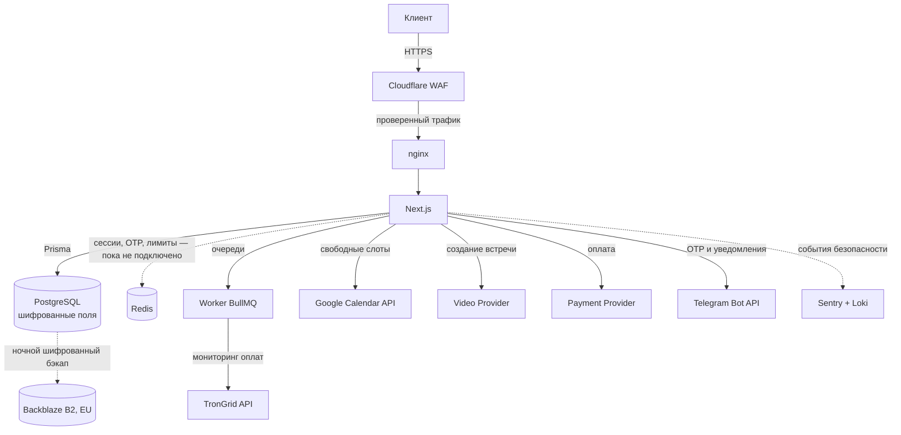

# 🏗️ 01 — Архитектура системы и обоснование стека

> Документ отвечает на вопрос «почему именно эти технологии, а не другие».
> Каждый выбор — с объяснением на человеческом языке и с честным минусом.

---

## 1. Главный архитектурный принцип

Проект состоит из двух сайтов, склеенных в одно приложение, но с **разными законами физики**:

| | Публичная часть | Личный кабинет |
|---|---|---|
| Главное требование | **Скорость и видимость в Google** | **Безопасность и корректность** |
| Данные | общедоступные | медицинская тайна, деньги |
| Как отдаём страницу | заранее собранный HTML (SSG/ISR) | рендер на сервере под каждого (SSR, без кэша) |
| Индексация Google | обязательна | **запрещена** (`noindex`, `Disallow`) |
| Если упадёт | неприятно | недопустимо |

Из этого следует правило, которое нельзя нарушать никогда:

> 🔒 **Ни один байт данных клиента не должен попасть в кэшируемый ответ.**
> Всё, что живёт под `/cabinet/*`, отдаётся с `Cache-Control: no-store` и вырезается из CDN на уровне Cloudflare.

---

## 2. Итоговый стек

| Слой | Выбор | Версия |
|---|---|---|
| Frontend + Backend | **Next.js (App Router) + React + TypeScript** | 15.x / 19.x / 5.x |
| Стили | **Tailwind CSS v4** + CSS-переменные | 4.x |
| База данных | **PostgreSQL** + расширение `pgcrypto` | 17 |
| ORM (слой доступа к БД) | **Prisma** | 6.x |
| Кэш, сессии, очереди | **Redis** + BullMQ | ⬜ не подключено — вернётся с кабинетом |
| Авторизация | **Auth.js (NextAuth v5)** + свой OTP-провайдер | 5.x |
| Валидация данных | **Zod** | 4.x |
| Привратник | **nginx** | 1.27 |
| Контейнеры | **Docker + Docker Compose** | 29.x |
| Инфраструктура как код | **Terraform** (Cloudflare + Hetzner) | 1.9+ |
| CI/CD | **GitHub Actions** | — |
| Защита периметра | **Cloudflare** (WAF, Anti-DDoS, Bot Management) | — |
| Ошибки и логи | **Sentry** + Grafana Loki | — |

---

## 3. Почему Next.js, а не Nuxt / Astro / WordPress

**Задача, которую нужно решить.** Нужен сайт, который одновременно:
мгновенно открывается и идеально читается Google-ботом (значит — HTML готов **до** запроса),
и при этом умеет быть сложным приложением с личным кабинетом (значит — нужен полноценный фронтенд).
Обычно это два разных проекта. Next.js позволяет сделать их одним.

**Ключевая способность — выбор режима отрисовки для каждой страницы отдельно:**

| Страница | Режим | Что происходит |
|---|---|---|
| Главная, «Обо мне», оферта | **SSG** | HTML собран при сборке. Сервер просто отдаёт файл. ~30 мс |
| Прайс, медиа-хаб | **ISR** | Собран заранее, но сам пересобирается раз в N минут |
| Кабинет, расписание | **SSR, no-store** | Собирается персонально при каждом запросе, никогда не кэшируется |

**Почему не другие:**

- **WordPress** — 60 % взломов сайтов в мире приходится на него и его плагины. Для медданных исключено.
- **Nuxt (Vue)** — технически равноценен, отличная альтернатива. Выбрали Next, потому что экосистема React больше: библиотеки календарей, платёжные SDK, готовые аудиты доступности.
- **Astro** — быстрее всех на статике, но слабее там, где нужен сложный интерактивный кабинет.
- **Раздельные фронт + бэк (React + NestJS)** — правильнее для команды из 10 человек. Для одного владельца это два деплоя, два репозитория и вдвое больше поломок.

**Честный минус Next.js:** он развивается быстро, мажорные версии иногда ломают совместимость.
Лечится закреплением версий (`package-lock.json`) и обновлением по расписанию, а не «когда вышло».

---

## 4. Почему PostgreSQL, а не MongoDB

Одна фраза объясняет всё: **транзакции**.

Представьте бронирование: нужно одновременно (а) занять слот, (б) списать оплату,
(в) создать ссылку на видеозвонок. Если электричество моргнёт посередине — недопустимо,
чтобы деньги списались, а слот остался свободным.

PostgreSQL умеет сказать: «эти три действия — одно целое, либо всё, либо ничего».
Плюс у нас строгие связи (клиент → сессия → платёж → чек), а это ровно то, для чего придуманы
реляционные базы.

Дополнительные аргументы:
- `pgcrypto` — шифрование прямо в базе, на уровне отдельных полей;
- Row Level Security — база сама запрещает клиенту А увидеть строки клиента Б, **даже если в коде допущена ошибка**. Это второй рубеж обороны;
- `SELECT ... FOR UPDATE SKIP LOCKED` — честная защита от двойного бронирования одного слота двумя людьми в одну секунду.

**Prisma** сверху — это слой, который превращает запросы к базе в обычный типизированный код.
Побочный, но важный эффект: Prisma параметризует все запросы, поэтому **SQL-инъекция становится
невозможной by design**, а не «потому что разработчик не забыл экранировать».

---

## 5. Модульность там, где завтра всё поменяется

Два места в проекте почти гарантированно будут меняться: **видеосвязь** и **платежи**.
Поэтому они строятся по паттерну «фабрика»: код приложения не знает, кто именно исполнитель.

### 5.1 VideoCall Factory

```
        Приложение говорит: «создай встречу 14:00, 50 минут»
                              │
                    ┌─────────▼─────────┐
                    │ IVideoProvider    │  ← единый интерфейс
                    │ createMeeting()   │
                    │ cancelMeeting()   │
                    │ getJoinUrl()      │
                    └─────────┬─────────┘
        ┌──────────┬──────────┼──────────┬──────────┐
     Zoom      Google Meet  Телемост  VK Звонки   Jitsi
                                                (self-hosted)
```

Смена провайдера = одна строка в переменных окружения `VIDEO_PROVIDER=zoom`.
Код бронирования при этом не меняется вообще.

### 5.2 Payment Provider

```
                    ┌─────────────────────┐
                    │  PaymentProvider    │  (абстрактный класс)
                    │  createPayment()    │
                    │  verifyWebhook()    │
                    │  refund()           │
                    │  getStatus()        │
                    └──────────┬──────────┘
     ┌────────┬────────┬───────┼────────┬──────────┐
  Stripe   PayPal   ЮKassa  Robokassa Prodamus  CryptoTRC20
   (EU)     (EU)     (RU)     (RU)      (RU)    (USDT/TRON)
```

Маршрутизация выбирается по стране клиента и валюте. Важно: **платёжный статус в нашей базе
меняется только от webhook-а провайдера с проверенной подписью**, никогда — от возврата
браузера пользователя на страницу «спасибо». Это защита от простейшего мошенничества.

### 5.3 Крипто-модуль (USDT TRC-20) — как устроен

```
1. Клиент выбирает «оплатить USDT»
2. Генерируем ОДНОРАЗОВЫЙ адрес из HD-кошелька (m/44'/195'/0'/0/{index})
   → приватные ключи на сервере не хранятся, только публичный xpub
3. Добавляем «соль» к сумме: 50.00 → 50.0417 USDT
   → сумма становится уникальной, платёж однозначно сопоставляется
4. Воркер (BullMQ, каждые 30 сек) опрашивает TronGrid API
5. Нашли перевод: сумма совпала ± 0 и подтверждений ≥ 19 → платёж подтверждён
6. Адрес больше не переиспользуется никогда
7. Не оплачено за 30 минут → инвойс истёк
```

---

## 6. Как устроен вход без пароля

```
┌─────────────────────────────────────────────────────────────┐
│  Клиент выбирает один из способов                           │
├──────────────────────┬──────────────────────────────────────┤
│  OAuth 2.0           │  OTP-код                             │
│  Google / Apple      │  Telegram-бот / WhatsApp Business    │
│  (PKCE + state)      │  (6 цифр, 5 минут, 3 попытки)        │
└──────────┬───────────┴───────────────┬──────────────────────┘
           └───────────┬───────────────┘
                       ▼
            Создание серверной сессии
                       │
      ┌────────────────┴─────────────────┐
      │ access-token  JWT, 15 минут      │  httpOnly + Secure
      │ refresh-token 30 дней, ротация   │  + SameSite=Lax
      └──────────────────────────────────┘
```

**Почему вообще без паролей.** База паролей — это актив, который можно украсть. Даже правильно
захешированные пароли — это риск, отчётность и обязанность уведомлять регулятора при утечке.
Если паролей нет, **красть нечего**: остаются только короткоживущие токены, привязанные к устройству.

**Почему JWT живёт всего 15 минут.** Если токен как-то утечёт, окно для его использования — 15 минут,
а не месяц. Незаметно для пользователя: refresh-токен молча продлевает сессию, и при каждом
продлении старый refresh аннулируется (ротация). Если кто-то попробует использовать уже
использованный refresh — это признак кражи, и мы убиваем **всю** цепочку сессий и пишем алерт.

---

## 7. Потоки данных — что куда идёт



---

## 8. Три ключевых архитектурных компромисса

Здесь нет «правильного» ответа — есть выбор, и его нужно делать осознанно.

### Компромисс 1. Красота против скорости загрузки

| Что хочется | Чем платим | Решение |
|---|---|---|
| Анимации при скролле, параллакс | +30–80 КБ JS, риск потерять Lighthouse 100 | ✅ Только CSS-анимации и `view-transition`. Библиотеки типа Framer Motion — **нет** |
| Видео-фон на первом экране | −20 баллов Performance, +5 МБ трафика | ❌ Запрещено. Вместо него — статичное AVIF-изображение |
| Красивый шрифт из Google Fonts | +150 мс на сторонний домен, вопросы по GDPR | ✅ Шрифт скачиваем и раздаём со своего домена (`next/font`), только используемые символы |
| Отзывы каруселью | +15 КБ JS | ✅ Нативный CSS scroll-snap, 0 КБ JS |

### Компромисс 2. Свежесть данных против скорости

| Страница | Насколько свежо | Что выбрали |
|---|---|---|
| Прайс | может отставать на 5 минут | ISR, `revalidate: 300` |
| Список лекций YouTube | может отставать на 6 часов | ISR, `revalidate: 21600` |
| Свободные слоты в календаре | **только реальное время** | SSR + `no-store` — здесь кэш недопустим, иначе двойная запись |
| Баланс и платежи | **только реальное время** | SSR + `no-store` |

Правило простое: **кэшируем всё, что не персонально и не про деньги.**

### Компромисс 3. Удобство входа против безопасности

| Что | Удобнее | Безопаснее | Наш выбор |
|---|---|---|---|
| Срок сессии | 30 дней | 15 минут | 15 мин + невидимое продление |
| «Запомнить меня» | да | нет | Да, но 30 дней максимум и только с привязкой к устройству |
| 2FA для клиента | не требовать | требовать | Не требуем: сам вход уже одноразовый |
| 2FA для психолога | не требовать | требовать | **Требуем жёстко.** Один аккаунт = доступ ко всем клиентам |

---

## 9. Что зафиксировано намертво, а что можно менять

### 🔒 Менять нельзя никогда (нарушение = юридический риск)

1. Данные клиентов хранятся только в ЕС.
2. Заметки о сессиях шифруются на уровне поля; ключ никогда не лежит в базе и в репозитории.
3. Кабинет отдаётся с `no-store` и закрыт от индексации.
4. Платёжный статус меняется только по подписанному webhook-у.
5. Каждый доступ к медицинским данным пишется в неизменяемый журнал аудита.
6. Секреты не попадают в git — CI падает, если найдены (Gitleaks).
7. Прод-деплой невозможен при проваленном security-сканировании.

### 🔧 Можно менять свободно

- Дизайн, тексты, цвета, порядок блоков.
- Провайдер видеосвязи (переключается переменной окружения).
- Набор платёжных провайдеров.
- Хостинг (весь стек в Docker → переезд занимает час).
- Cloudflare Free ↔ Pro ↔ Enterprise.
- Интервалы кэша (`revalidate`).
