# 🗄️ 02 — Схема базы данных (ERD)

> База данных — это скелет проекта. Ошибку в дизайне таблиц исправить в 10 раз дороже,
> чем ошибку в дизайне кнопки. Поэтому здесь мы думаем долго, а меняем редко.

---

## 1. Как читать эту схему

Каждый прямоугольник — таблица (например, «клиенты»). Линии между ними — связи.

| Обозначение | Читается как |
|---|---|
| `||--o{` | «один ко многим»: у одного клиента много записей на приём |
| `||--||` | «один к одному»: у одной записи на приём ровно одна видеовстреча |
| `}o--||` | «многие к одному» |
| 🔐 | поле зашифровано **AES-256-GCM** (в базе лежит нечитаемый бинарь) |
| #️⃣ | поле хранится только как хеш (оригинал восстановить нельзя) |

---

## 2. Полная схема

```mermaid
erDiagram
    USER ||--o{ OAUTH_ACCOUNT : "входит через"
    USER ||--o{ OTP_CHALLENGE : "запрашивает код"
    USER ||--o{ AUTH_SESSION : "имеет сессии"
    USER ||--o{ CONSENT : "даёт согласия"
    USER ||--|| CLIENT_PROFILE : "профиль клиента"
    USER ||--o| THERAPIST_PROFILE : "профиль психолога"
    USER ||--o{ AUDIT_LOG : "оставляет след"
    USER ||--o{ DATA_SUBJECT_REQUEST : "реализует права GDPR"
    USER ||--o{ NOTIFICATION : "получает"

    AUTH_SESSION ||--o{ REFRESH_TOKEN : "продлевается"

    CLIENT_PROFILE ||--o{ APPOINTMENT : "бронирует"
    THERAPIST_PROFILE ||--o{ APPOINTMENT : "проводит"
    THERAPIST_PROFILE ||--o{ AVAILABILITY_RULE : "задаёт график"
    THERAPIST_PROFILE ||--o{ AVAILABILITY_EXCEPTION : "отпуск и переносы"
    THERAPIST_PROFILE ||--o| CALENDAR_SYNC_STATE : "синхронизация Google"

    SERVICE ||--o{ SERVICE_PRICE : "цена по регионам"
    SERVICE ||--o{ APPOINTMENT : "тип услуги"

    APPOINTMENT ||--o| VIDEO_MEETING : "ссылка на созвон"
    APPOINTMENT ||--o| SESSION_NOTE : "заметка психолога"
    APPOINTMENT ||--o{ PAYMENT : "оплата"

    PAYMENT ||--o{ PAYMENT_EVENT : "история статусов"
    PAYMENT ||--o| CRYPTO_INVOICE : "если крипта"
    PAYMENT ||--o{ REFUND : "возвраты"

    LECTURE_CATEGORY ||--o{ LECTURE : "содержит"

    SECURITY_EVENT }o--o| USER : "связано с"
    HONEYPOT_HIT ||--o{ SECURITY_EVENT : "порождает"
    IP_BLOCKLIST ||--o{ SECURITY_EVENT : "основание бана"

    USER {
        uuid id PK
        citext email "🔐 шифр. + #️⃣ хеш для поиска"
        string phone_hash "#️⃣ только хеш"
        string telegram_id "🔐"
        enum role "CLIENT | THERAPIST | ADMIN"
        enum status "ACTIVE | SUSPENDED | DELETED"
        string locale "pl | en | ru"
        string timezone "IANA, напр. Europe/Warsaw"
        bool mfa_required "для THERAPIST всегда true"
        timestamptz created_at
        timestamptz last_login_at
        timestamptz deleted_at "мягкое удаление, GDPR"
    }

    OAUTH_ACCOUNT {
        uuid id PK
        uuid user_id FK
        enum provider "GOOGLE | APPLE"
        string provider_account_id "уникален в паре с provider"
        text access_token "🔐"
        text refresh_token "🔐"
        timestamptz expires_at
    }

    OTP_CHALLENGE {
        uuid id PK
        uuid user_id FK "может быть NULL до регистрации"
        enum channel "TELEGRAM | WHATSAPP"
        string destination_hash "#️⃣"
        string code_hash "#️⃣ argon2id, оригинал не хранится"
        int attempts "макс. 3"
        inet request_ip
        timestamptz expires_at "now + 5 минут"
        timestamptz consumed_at
    }

    AUTH_SESSION {
        uuid id PK
        uuid user_id FK
        string device_fingerprint_hash "#️⃣"
        inet ip
        string user_agent
        string geo_country "из Cloudflare"
        timestamptz created_at
        timestamptz last_seen_at
        timestamptz revoked_at
        string revoked_reason
    }

    REFRESH_TOKEN {
        uuid id PK
        uuid session_id FK
        string token_hash "#️⃣ sha-256"
        uuid replaced_by "цепочка ротации"
        bool used "повторное использование = кража"
        timestamptz expires_at
    }

    CONSENT {
        uuid id PK
        uuid user_id FK
        enum type "TOS | PRIVACY | HEALTH_DATA | MARKETING | COOKIES"
        string document_version "напр. privacy-2026-09-12"
        bool granted
        inet ip "доказательство согласия"
        text user_agent
        timestamptz granted_at
        timestamptz revoked_at
    }

    CLIENT_PROFILE {
        uuid id PK
        uuid user_id FK
        text display_name "🔐"
        text emergency_contact "🔐"
        text intake_form "🔐 анкета, JSON"
        date birth_date "🔐"
        enum preferred_lang
        timestamptz created_at
    }

    THERAPIST_PROFILE {
        uuid id PK
        uuid user_id FK
        string public_slug "для SEO-страницы"
        text bio_md
        jsonb credentials "образование, сертификаты"
        int default_session_minutes "50"
        int buffer_minutes "10 между сессиями"
        int cancel_window_hours "24"
        string calendar_id "Google Calendar"
    }

    CALENDAR_SYNC_STATE {
        uuid id PK
        uuid therapist_id FK
        string sync_token "инкрементальная синхронизация"
        string channel_id "Google push webhook"
        timestamptz channel_expires_at
        timestamptz last_full_sync_at
        enum status "OK | DEGRADED | FAILED"
    }

    AVAILABILITY_RULE {
        uuid id PK
        uuid therapist_id FK
        int weekday "0-6"
        time start_time_local
        time end_time_local
        string timezone
        date valid_from
        date valid_to
    }

    AVAILABILITY_EXCEPTION {
        uuid id PK
        uuid therapist_id FK
        timestamptz starts_at "UTC"
        timestamptz ends_at "UTC"
        enum kind "BLOCKED | EXTRA_SLOT"
        string reason
    }

    SERVICE {
        uuid id PK
        string slug "individual-50 | couples-90"
        string title_i18n "jsonb pl/en/ru"
        text description_i18n
        int duration_minutes
        bool is_active
        int sort_order
    }

    SERVICE_PRICE {
        uuid id PK
        uuid service_id FK
        string region "EU | PL | RU | BY | DEFAULT"
        string currency "EUR | PLN | RUB | USD"
        int amount_minor "в копейках/центах, целое число"
        timestamptz valid_from
        timestamptz valid_to
    }

    APPOINTMENT {
        uuid id PK
        uuid client_id FK
        uuid therapist_id FK
        uuid service_id FK
        timestamptz starts_at "UTC, всегда"
        timestamptz ends_at "UTC"
        enum status "PENDING_PAYMENT | CONFIRMED | COMPLETED | CANCELLED_CLIENT | CANCELLED_THERAPIST | NO_SHOW"
        string google_event_id
        string idempotency_key "защита от двойного клика"
        timestamptz cancelled_at
        text cancel_reason "🔐"
        timestamptz created_at
    }

    VIDEO_MEETING {
        uuid id PK
        uuid appointment_id FK
        enum provider "ZOOM | GOOGLE_MEET | TELEMOST | VK_CALLS | JITSI"
        string external_meeting_id
        text join_url "🔐 ссылка = доступ к сеансу"
        text host_url "🔐"
        string passcode "🔐"
        timestamptz created_at
        timestamptz revoked_at
    }

    SESSION_NOTE {
        uuid id PK
        uuid appointment_id FK
        uuid author_id FK "только THERAPIST"
        bytea content_ciphertext "🔐 AES-256-GCM"
        bytea content_iv
        string key_version "ротация ключей"
        bool client_visible "false по умолчанию"
        timestamptz created_at
        timestamptz updated_at
    }

    PAYMENT {
        uuid id PK
        uuid appointment_id FK
        uuid client_id FK
        enum provider "STRIPE | PAYPAL | YOOKASSA | ROBOKASSA | PRODAMUS | CRYPTO_TRC20"
        enum status "CREATED | PENDING | PAID | FAILED | EXPIRED | REFUNDED | PARTIAL_REFUND"
        int amount_minor
        string currency
        string external_id "id на стороне провайдера"
        string idempotency_key "UNIQUE"
        jsonb provider_payload "без карточных данных"
        timestamptz created_at
        timestamptz paid_at
    }

    PAYMENT_EVENT {
        uuid id PK
        uuid payment_id FK
        enum from_status
        enum to_status
        string source "WEBHOOK | WORKER | ADMIN"
        bool signature_valid "webhook без подписи не применяется"
        jsonb raw_event
        timestamptz created_at
    }

    CRYPTO_INVOICE {
        uuid id PK
        uuid payment_id FK
        string network "TRON_TRC20"
        string asset "USDT"
        string address "одноразовый, не переиспользуется"
        int derivation_index "путь HD-кошелька"
        string expected_amount "точная сумма с солью, напр. 50.0417"
        string received_amount
        string tx_hash
        int confirmations
        int required_confirmations "19"
        timestamptz expires_at "now + 30 минут"
    }

    REFUND {
        uuid id PK
        uuid payment_id FK
        int amount_minor
        enum status "REQUESTED | DONE | FAILED"
        string reason
        uuid approved_by FK
        timestamptz created_at
    }

    LECTURE_CATEGORY {
        uuid id PK
        string slug
        string title_i18n
        int sort_order
    }

    LECTURE {
        uuid id PK
        uuid category_id FK
        string youtube_id
        string title
        text description
        int duration_seconds
        string thumbnail_url
        timestamptz published_at
        int view_count "кэш из YouTube API"
        timestamptz synced_at
        bool is_visible
    }

    TESTIMONIAL {
        uuid id PK
        string author_alias "только псевдоним, не имя"
        text body
        int rating
        bool is_published
        timestamptz created_at
    }

    AUDIT_LOG {
        uuid id PK
        uuid actor_id FK
        string action "напр. session_note.read"
        string entity_type
        uuid entity_id
        inet ip
        string user_agent
        jsonb metadata "без содержимого мед. данных"
        string prev_hash "цепочка целостности"
        string row_hash "запись нельзя подменить незаметно"
        timestamptz created_at "APPEND ONLY, удаление запрещено"
    }

    SECURITY_EVENT {
        uuid id PK
        uuid user_id FK "может быть NULL"
        enum kind "LOGIN_FAILED | OTP_BRUTEFORCE | HONEYPOT | RATE_LIMIT | CSRF_FAIL | SSRF_BLOCK | ANOMALY"
        enum severity "LOW | MEDIUM | HIGH | CRITICAL"
        inet ip
        string country
        string path
        jsonb details
        timestamptz created_at
    }

    HONEYPOT_HIT {
        uuid id PK
        string trap_id "какая именно ловушка сработала"
        enum trap_type "PATH | FORM_FIELD | ROBOTS_BAIT | FAKE_API | JS_BEACON"
        inet ip
        string user_agent
        text request_headers
        text request_body "обрезано до 4 КБ"
        int score_delta "вклад в решение о бане"
        timestamptz created_at
    }

    IP_BLOCKLIST {
        uuid id PK
        inet ip
        cidr network "можно банить подсеть"
        int score "накопленный балл нарушений"
        enum action "CHALLENGE | BLOCK"
        string reason
        bool pushed_to_cloudflare
        timestamptz expires_at "временный бан"
        timestamptz created_at
    }

    DATA_SUBJECT_REQUEST {
        uuid id PK
        uuid user_id FK
        enum kind "EXPORT | DELETE | RECTIFY | RESTRICT"
        enum status "NEW | IN_PROGRESS | DONE | REJECTED"
        text notes
        timestamptz due_at "закон: 30 дней"
        timestamptz completed_at
    }

    NOTIFICATION {
        uuid id PK
        uuid user_id FK
        enum channel "EMAIL | TELEGRAM | PUSH"
        enum template "BOOKING_CONFIRMED | REMINDER_24H | REMINDER_1H | PAYMENT_RECEIVED | CANCELLED"
        enum status "QUEUED | SENT | FAILED"
        jsonb payload "без мед. содержимого"
        timestamptz scheduled_at
        timestamptz sent_at
    }
```

---

## 3. Восемь решений в схеме, которые важно понять

### 3.1 Деньги — целые числа, никогда не дробные

`amount_minor` = сумма в **центах**. 50 евро → `5000`.
Причина: компьютер не умеет точно хранить `0.1 + 0.2` (получится `0.30000000000000004`).
На тысяче транзакций это превращается в расхождение с бухгалтерией. Целые числа расхождений не дают.

### 3.2 Время — всегда UTC

Психолог в Варшаве, клиент в Минске, сервер в Германии, а ещё дважды в год переводят часы.
Единственный способ не сойти с ума: **в базе всё в UTC**, перевод в местное время — только
в момент показа на экране. Таймзона пользователя хранится отдельным полем.

### 3.3 Email хранится дважды

Кажется странным, но необходимо: **шифрованный** (чтобы при утечке базы не получить список
клиентов психолога — это само по себе чувствительная информация) и **хеш** (чтобы можно было
найти пользователя при входе, не расшифровывая всю таблицу).

### 3.4 Заметки о сессиях — отдельная таблица с отдельным ключом

Самые чувствительные данные вынесены в `SESSION_NOTE`. Даже если злоумышленник получит дамп
базы целиком, он увидит бинарный мусор: ключ шифрования лежит **не в базе**, а в отдельном
хранилище секретов. Поле `key_version` позволяет менять ключ раз в год без остановки сервиса.

### 3.5 `AUDIT_LOG` — только добавление, с цепочкой хешей

Каждая строка хранит хеш предыдущей (как в блокчейне). Если кто-то удалит или изменит запись
в середине — цепочка порвётся, и ночная проверка это заметит. Это прямое требование ISO 27001
и то, что первым делом спросит аудитор: «покажите, кто и когда открывал карту пациента».

### 3.6 `idempotency_key` — защита от двойного клика

Клиент нервничает, дважды жмёт «Оплатить». Без этого поля — две записи и два списания.
С ним вторая попытка вернёт результат первой. Поле `UNIQUE` в базе, а не проверка в коде:
база — последний арбитр, она не ошибается даже при гонке запросов.

### 3.7 Удаление — мягкое (`deleted_at`), но с оговоркой

GDPR даёт право «быть забытым», однако польское и европейское право одновременно требует
хранить финансовые документы (5 лет) и медицинскую документацию.
Решение: персональные данные анонимизируются (имя → `Deleted User #1234`, заметки удаляются
физически), а финансовые записи остаются обезличенными. Это законно и проходит аудит.

### 3.8 Row Level Security — вторая линия обороны

В PostgreSQL включаем политики: даже если в коде появится ошибка вроде
`SELECT * FROM appointments` без фильтра по клиенту, база сама вернёт **только строки текущего
пользователя**. Разработчик может ошибиться; база — нет.

---

## 4. Индексы, которые обязаны быть с первого дня

| Таблица | Индекс | Зачем |
|---|---|---|
| `appointment` | `(therapist_id, starts_at)` | поиск свободных слотов — самый частый запрос |
| `appointment` | `UNIQUE (therapist_id, starts_at) WHERE status IN (...)` | физически запрещает двойное бронирование |
| `payment` | `UNIQUE (idempotency_key)` | защита от дублей |
| `user` | `UNIQUE (email_hash)` | вход |
| `otp_challenge` | `(destination_hash, created_at)` | контроль перебора |
| `audit_log` | `(entity_type, entity_id, created_at)` | ответ аудитору за секунды |
| `security_event` | `(ip, created_at)` | автоматический бан по накоплению баллов |
| `crypto_invoice` | `UNIQUE (address)` | адрес не переиспользуется никогда |

---

## 5. Что будет дальше

Схема реализована в коде: [`prisma/schema.prisma`](../prisma/schema.prisma).
Любое изменение схемы делается **только через миграцию** (`prisma migrate`), которая
сохраняется в git — чтобы всегда можно было откатиться и чтобы аудитор видел историю изменений.
