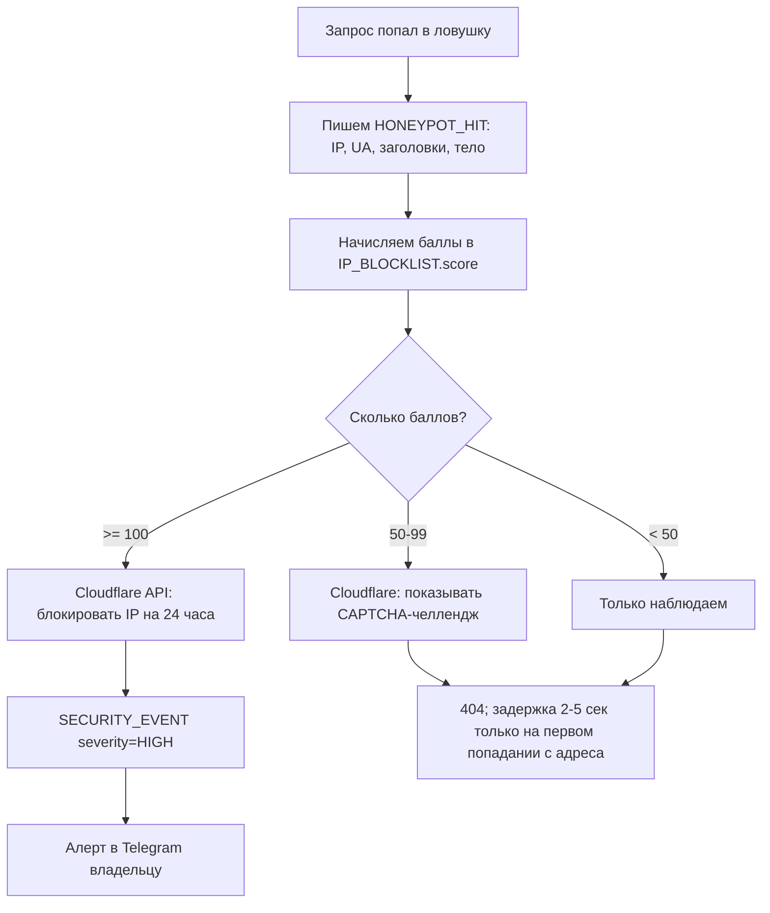

# 🛡️ 03 — Политика безопасности, шифрование и ловушки для взломщиков

> Принцип, из которого мы исходим: **Zero Trust** — «не доверяем никому и ничему по умолчанию».
> Ни браузеру, ни своему же коду, ни даже собственной базе данных.
> Каждый запрос проверяется заново, как будто он пришёл от злоумышленника.

---

## 1. Семь рубежей обороны

Безопасность — это не забор, а луковица. Пробить один слой должно быть недостаточно.

```
   Атакующий
       │
   ┌───▼──────────────────────────────────────────────┐
 1 │ CLOUDFLARE: Anti-DDoS, WAF, Bot Management       │  гасится ДО сервера
   ├──────────────────────────────────────────────────┤
 2 │ NGINX: TLS 1.3, rate limit, лимит размера тела   │  гасится ДО приложения
   ├──────────────────────────────────────────────────┤
 3 │ MIDDLEWARE: CSP, CSRF, honeypot, гео-правила     │  до бизнес-логики
   ├──────────────────────────────────────────────────┤
 4 │ ПРИЛОЖЕНИЕ: авторизация, Zod-валидация, ACL      │  проверка прав на каждое действие
   ├──────────────────────────────────────────────────┤
 5 │ БАЗА: Row Level Security, параметризация         │  база сама не отдаст чужое
   ├──────────────────────────────────────────────────┤
 6 │ ДАННЫЕ: AES-256-GCM на полях, ключ вне базы      │  дамп базы бесполезен
   ├──────────────────────────────────────────────────┤
 7 │ АУДИТ: неизменяемый журнал + алерты              │  если пробили — узнаем сразу
   └──────────────────────────────────────────────────┘
```

---

## 2. Шифрование: три состояния данных

### 2.1 In transit — «в пути» (между браузером и сервером)

| Параметр | Значение | Почему |
|---|---|---|
| Протокол | **TLS 1.3 только** | TLS 1.2 и ниже отключены: там живут известные атаки |
| Шифры | `TLS_AES_256_GCM_SHA384`, `TLS_CHACHA20_POLY1305_SHA256` | современные AEAD |
| HSTS | `max-age=63072000; includeSubDomains; preload` | браузер физически не даст открыть сайт по HTTP |
| Сертификат | Let's Encrypt, автопродление | бесплатно, автоматически |
| Цель | **A+ на ssllabs.com** | проверяется в CI |

### 2.2 At rest — «в покое» (на диске сервера)

Три уровня, друг поверх друга:

1. **Диск сервера** — LUKS-шифрование тома.
2. **База целиком** — шифрованные тома Hetzner + шифрованные бэкапы (`age`/GPG).
3. **Отдельные поля** — самое важное: AES-256-GCM на уровне приложения.

```
Поле «заметка о сессии» проходит путь:

  Текст психолога
        │
        ▼  AES-256-GCM, уникальный IV на каждую запись
  ┌─────────────────────┐
  │ ciphertext + tag    │ → в PostgreSQL (bytea)
  │ iv                  │ → в PostgreSQL (bytea)
  │ key_version = "v1"  │ → в PostgreSQL (text)
  └─────────────────────┘
        ▲
        │ ключ шифрования
  ┌─────┴───────────────────────────┐
  │ НЕ в базе. НЕ в git. НЕ в коде. │
  │ Хранилище: Infisical / Vault /  │
  │ SOPS+age, доступ по одной роли  │
  └─────────────────────────────────┘
```

**Зачем `key_version`.** Раз в год ключ меняется. Старые записи продолжают читаться старым ключом,
новые пишутся новым, миграция идёт фоном. Ротация без простоя — требование ISO 27001 (A.10.1).

### 2.3 In use — «в работе» (в оперативной памяти)

- Расшифрованный текст живёт в памяти только на время формирования ответа.
- Запрещено логировать расшифрованное содержимое — в логгере стоит фильтр по списку полей.
- Sentry настроен на `beforeSend`, который вырезает поля из чёрного списка.

### 2.4 Про «E2E-шифрование» — честно

Настоящее сквозное шифрование (когда сервер физически не может прочитать данные) в вебе означает,
что ключ хранится в браузере клиента. Последствия: потерял устройство — потерял всю историю
безвозвратно; психолог не может открыть заметку с другого компьютера; поиск по заметкам невозможен.

**Наше решение:** E2E применяем там, где он даёт пользу без катастрофических минусов
(сообщения в чате «клиент ↔ психолог»), а медицинские записи защищаем схемой
«envelope encryption + ключ вне базы + аудит доступа». Это то, что реально используют
медицинские системы и что принимают аудиторы. Решение зафиксировано в Decision Log.

---

## 3. Защита от конкретных атак

| Атака | Что это простыми словами | Как закрыто |
|---|---|---|
| **SQL-инъекция** | В поле «имя» пишут кусок команды для базы и крадут таблицу | Prisma параметризует всё; сырой SQL запрещён линтером; RLS как второй рубеж |
| **XSS** | На страницу подсаживают чужой JS и крадут сессию | React экранирует по умолчанию; `dangerouslySetInnerHTML` запрещён ESLint-правилом; строгий CSP с nonce |
| **CSRF** | Чужой сайт заставляет ваш браузер отправить запрос от вашего имени | `SameSite=Lax` + double-submit токен в Server Actions + проверка `Origin` / `Sec-Fetch-Site` |
| **SSRF** | Заставляют сервер сходить по внутреннему адресу и достать секреты | Белый список доменов для исходящих запросов; запрет приватных диапазонов (`10.*`, `169.254.169.254`); отдельный HTTP-клиент с проверкой после DNS-резолва |
| **Перебор OTP** | Робот подбирает 6-значный код | 3 попытки → код сгорает; лимит на IP и на получателя; экспоненциальная задержка; коды из `crypto.randomInt` |
| **Кража сессии** | Перехват токена | httpOnly (JS не видит), Secure, SameSite, 15 минут жизни, привязка к отпечатку устройства |
| **Двойное бронирование** | Два клиента жмут одну кнопку одновременно | UNIQUE-индекс в базе + `SELECT FOR UPDATE SKIP LOCKED` |
| **Подделка платежа** | «Я оплатил» без оплаты | Статус меняется только по webhook с валидной HMAC-подписью; сумма и валюта сверяются |
| **Clickjacking** | Ваш сайт в невидимом iframe поверх кнопки | `frame-ancestors 'none'` + `X-Frame-Options: DENY` |
| **Прямой доступ к серверу мимо Cloudflare** | Находят реальный IP и бьют напрямую | Firewall принимает 80/443 **только с IP-диапазонов Cloudflare** |
| **Утечка через зависимости** | Взломали чужую npm-библиотеку | `npm audit` + Trivy + Dependabot в CI, lock-файл зафиксирован |

---

## 4. 🍯 Honeypot: ловушки для сканеров

### 4.1 Идея

Обычный посетитель **никогда** не откроет `/wp-admin/`, не заполнит невидимое поле в форме
и не полезет в `/.env`. Если кто-то это сделал — перед нами не человек, а сканер уязвимостей.
Значит, его можно банить **до** того, как он найдёт что-то настоящее.

Ловушка ценна ещё и тем, что даёт **нулевой процент ложных срабатываний**: невозможно
попасть в неё случайно.

### 4.2 Пять типов ловушек

```
┌──────────────────────────────────────────────────────────────────┐
│ ТИП 1 — ФАЛЬШИВЫЕ ПУТИ                        балл: +50          │
│ /wp-admin/, /wp-login.php, /.env, /.git/config,                  │
│ /phpmyadmin/, /admin.php, /config.json, /backup.sql,             │
│ /.aws/credentials, /api/v1/debug                                 │
│ → Отвечаем 404; первое попадание с адреса — с задержкой 2-5 сек  │
├──────────────────────────────────────────────────────────────────┤
│ ТИП 2 — НЕВИДИМЫЕ ПОЛЯ ФОРМ                   балл: +80          │
│ <input name="website_url" tabindex="-1" aria-hidden="true">      │
│ спрятан CSS-ом, не display:none (умные боты это видят)           │
│ → Человек не заполнит. Заполнено = бот. Форма «успешно принята», │
│   но никуда не уходит.                                           │
├──────────────────────────────────────────────────────────────────┤
│ ТИП 3 — ПРИМАНКА В robots.txt                 балл: +60          │
│ Disallow: /internal-admin-v2/                                    │
│ → Честный краулер послушается. Сканер полезет именно туда,       │
│   потому что «запрещено = интересно».                            │
├──────────────────────────────────────────────────────────────────┤
│ ТИП 4 — ФАЛЬШИВЫЙ API                         балл: +90          │
│ /api/internal/users?export=all  — выглядит как утечка            │
│ → Отдаём правдоподобные фейковые данные с водяным знаком         │
│   (уникальные email-«канарейки»). Если такой email где-то        │
│   всплывёт — мы точно знаем дату и IP источника утечки.          │
├──────────────────────────────────────────────────────────────────┤
│ ТИП 5 — ВРЕМЕННАЯ ЛОВУШКА                     балл: +40          │
│ Форма отправлена быстрее чем за 1.5 секунды после загрузки       │
│ → Человек физически не успевает прочитать и заполнить.           │
└──────────────────────────────────────────────────────────────────┘
```

### 4.3 Что происходит после срабатывания



**Важная деталь:** бан ставится **в Cloudflare**, а не на нашем сервере. Разница принципиальная:
заблокированный трафик разворачивается в датацентре Cloudflare и до нашего канала не доходит вообще.

### 4.4 Защита от ложных срабатываний

| Риск | Страховка |
|---|---|
| Google-бот полезет в приманку | Белый список: проверка reverse-DNS настоящих ботов Google/Bing |
| Клиент за корпоративным NAT | Баны временные (24 ч), CAPTCHA раньше блокировки, страница «разбанить себя» |
| Мониторинг сам себя забанит | IP систем мониторинга в постоянном allowlist |
| Пентестер по договору | Заголовок `X-Pentest-Token` с секретом отключает ловушки |

---

## 5. Заголовки безопасности (реализованы в коде)

```
Strict-Transport-Security: max-age=63072000; includeSubDomains; preload
Content-Security-Policy: default-src 'self'; script-src 'self' 'nonce-{RANDOM}' 'strict-dynamic';
                         frame-ancestors 'none'; base-uri 'none'; form-action 'self';
                         object-src 'none'; upgrade-insecure-requests
X-Content-Type-Options: nosniff
X-Frame-Options: DENY
Referrer-Policy: strict-origin-when-cross-origin
Permissions-Policy: camera=(), microphone=(), geolocation=(), payment=(), interest-cohort=()
Cross-Origin-Opener-Policy: same-origin
Cross-Origin-Embedder-Policy: require-corp
Cross-Origin-Resource-Policy: same-origin
```

**Про CSP с nonce — самое важное место.** `nonce` — случайное число, генерируемое заново на
каждый запрос. Браузер выполнит только те скрипты, у которых этот nonce есть.
Итог: даже если злоумышленник сумеет вставить `<script>` в страницу, браузер его **не запустит** —
nonce угадать невозможно. Это превращает XSS из катастрофы в неудавшуюся попытку.

⚠️ Именно поэтому в проекте **запрещены** inline-скрипты без nonce, `eval()`, и виджеты сторонних
сервисов, которые требуют `unsafe-inline`. Если какой-то сервис аналитики требует ослабить CSP —
ответ «нет», ищем другой сервис.

---

## 6. Конвейер безопасности в CI/CD

Ни один коммит не доезжает до прода без прохождения всех ворот:

| Этап | Инструмент | Что ловит | Падает сборка? |
|---|---|---|---|
| Секреты | **Gitleaks** | пароль/ключ, случайно попавший в код | ✅ да |
| SAST | **Semgrep** + **CodeQL** | инъекции, небезопасные паттерны | ✅ при HIGH |
| Типы | **tsc --noEmit** | ошибки типов | ✅ да |
| Линт | **ESLint** (+ плагин security) | опасные конструкции | ✅ да |
| Зависимости | **npm audit** + **Dependabot** | известные CVE в библиотеках | ✅ при HIGH/CRITICAL |
| Контейнер | **Trivy** | уязвимости в образе Docker | ✅ при HIGH |
| Инфраструктура | **Checkov** | ошибки в Terraform (открытые порты и т.п.) | ✅ да |
| DAST | **OWASP ZAP baseline** | атака на поднятое приложение | ⚠️ предупреждение |
| Заголовки | свой скрипт | проверка всех security-заголовков | ✅ да |
| Lighthouse | **LHCI** | падение производительности | ⚠️ порог 95 |

---

## 7. Соответствие GDPR (владелец в Польше)

| Требование | Как выполнено |
|---|---|
| Правовое основание (ст. 6, 9) | Явное согласие на обработку данных о здоровье, фиксируется в `CONSENT` с IP и версией документа |
| Минимизация данных | Не спрашиваем то, что не нужно. Никаких паспортов и адресов |
| Право на доступ (ст. 15) | Кнопка «выгрузить мои данные» → ZIP с JSON за 24 часа |
| Право на забвение (ст. 17) | Кнопка «удалить аккаунт» → анонимизация за 30 дней с сохранением финансовой отчётности |
| Право на переносимость (ст. 20) | Экспорт в машиночитаемом JSON |
| Уведомление об утечке (ст. 33) | Регламент: уведомить UODO в течение **72 часов**. Шаблон письма готовится в Sprint 6 |
| Реестр обработки (ст. 30) | Документ RoPA, поддерживается вручную |
| DPIA (ст. 35) | Обязательна: данные о здоровье. Готовится в Sprint 6 |
| Договоры с подрядчиками (ст. 28) | DPA с Hetzner, Cloudflare, платёжными провайдерами |
| Передача за пределы ЕС | Zoom/Stripe — только на основании SCC; по возможности EU-регионы |

---

## 8. Что делать, если всё-таки взломали (Incident Response)

Инструкция на холодную голову — потому что в момент инцидента думать некогда.

```
1. ИЗОЛЯЦИЯ (0-15 минут)
   Cloudflare → режим "Under Attack"
   Отозвать ВСЕ сессии: TRUNCATE refresh_token; UPDATE auth_session SET revoked_at = now()
   Снять снимок диска ДО любых изменений (это улика)

2. ОЦЕНКА (15-60 минут)
   Проверить AUDIT_LOG: цепочка хешей цела?
   Что именно утекло: только метаданные или содержимое заметок?
   Ключи шифрования скомпрометированы?

3. УСТРАНЕНИЕ (1-6 часов)
   Ротация ВСЕХ секретов: JWT-ключи, API-токены, доступ к базе
   Откат на заведомо чистый образ Docker
   Закрытие уязвимости

4. УВЕДОМЛЕНИЕ (до 72 часов — требование закона)
   UODO (польский регулятор) — если есть риск для прав субъектов
   Затронутые клиенты — на понятном языке, без юридического тумана

5. РАЗБОР (неделя)
   Post-mortem без поиска виноватых
   Новый тест в CI, который поймал бы это раньше
   Запись в PROJECT_LOG.md → Decision Log
```

---

## 9. Красные линии — не обсуждается

1. **Секрет в git = инцидент.** Даже в приватном репозитории. Ротация ключа обязательна.
2. **Прод-база на ноутбуке — никогда.** Для разработки только синтетические данные.
3. **Нет доступа «посмотреть быстренько».** Любое чтение карты клиента пишется в аудит.
4. **2FA для аккаунта психолога и админа — обязательно**, без исключений.
5. **Бэкап без проверенного восстановления не считается бэкапом.** Тест раз в квартал.
6. **`console.log` с персональными данными — блокирует merge.**
7. **Новая внешняя зависимость требует обоснования.** Каждая библиотека — потенциальная дверь.
